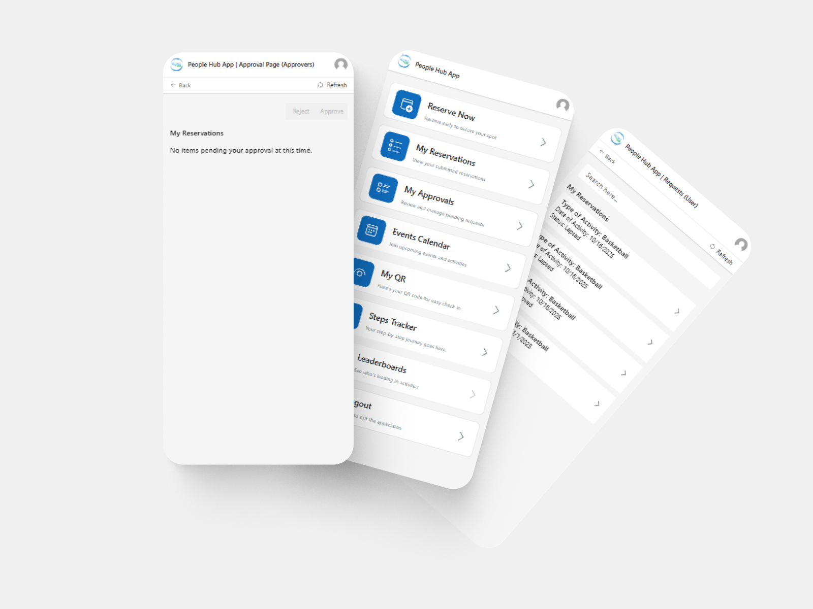
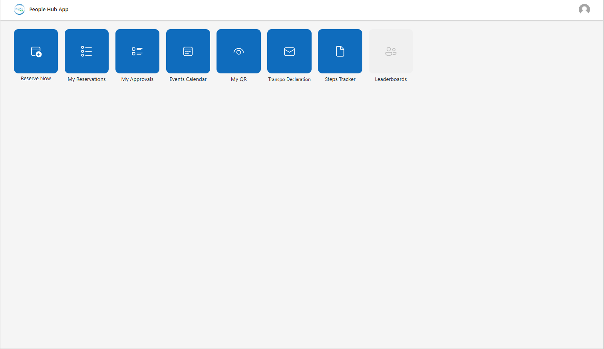
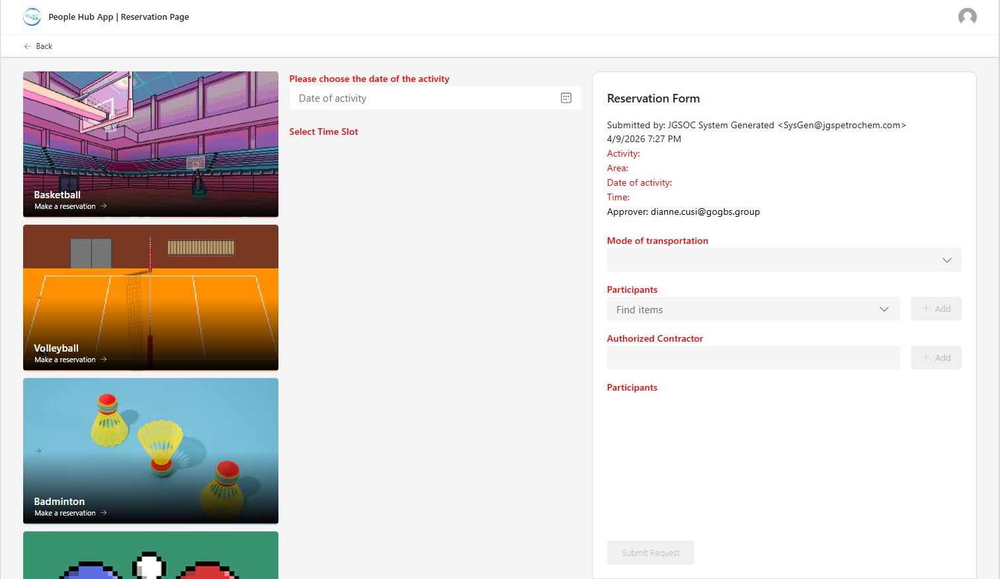
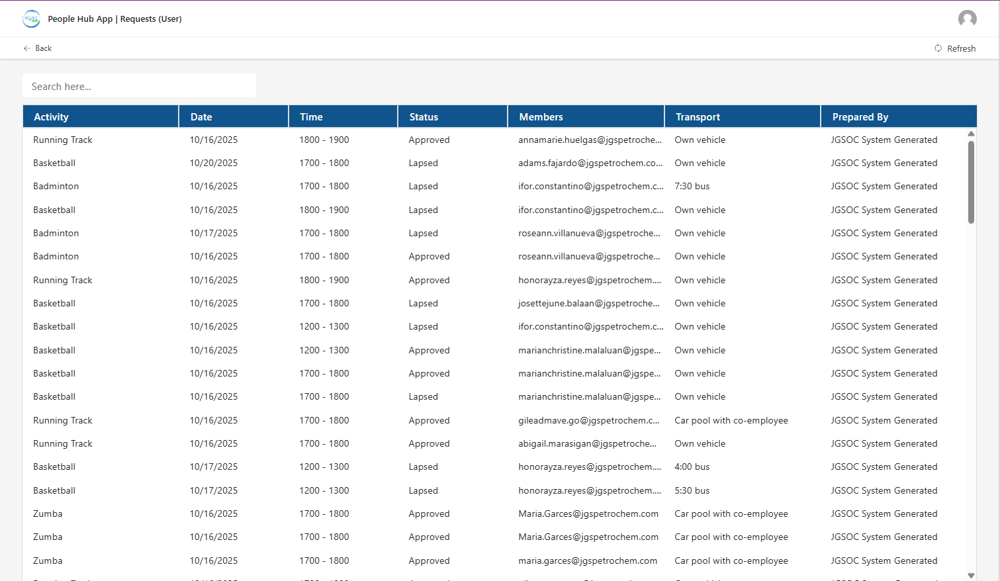
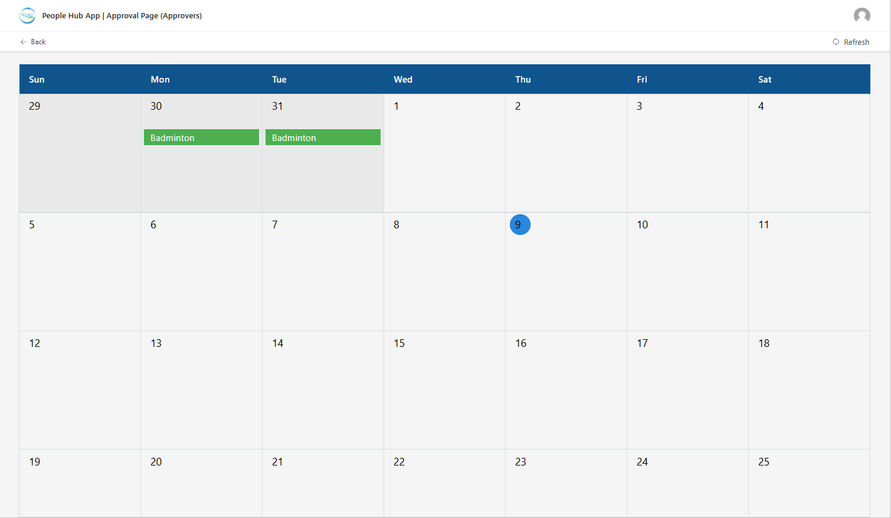

# 📱 Nurse App (PowerApps)

---

## 📌 Project Overview
A PowerApps-based system designed for managing nurse profiles, earnings, and patient-related records. Built with a focus on performance, scalability, and clean UI/UX, while handling real-world limitations like delegation and large datasets.

---

## 🖼️ UI Preview

---

## ⚙️ What’s Under the Hood
This project goes beyond basic PowerApps by applying structured logic and performance optimizations:

- **Data Handling Strategy:**
  - Delegation-aware queries
  - Power Automate Fetching logic to bypass record limits
- **Role-Based Logic:**
  - Conditional rendering based on user roles
  - Secured actions

---

## ✨ Features
- 🔐 Role-based access control  
- ✅ User input validation  
- 🪟 Custom modals  
- 🎨 Minimalist design  
- ⚡ Optimized solution  

---

## 🛠️ Tech Stack
- **PowerApps (Canvas App)**
- **Power Fx**
- **Data Source:** SharePoint (Lists)  
- **Power Automate**

---

## ⚠️ Challenges
- Delegation limits (500–2000 records)  
- Performance issues with large datasets  
- Maintaining clean UX without relying on native components  
- Positioning custom “more options” modals dynamically (attaching them to the correct UI element)

---

## 💡 Solutions Implemented
- Built **custom pagination system**
- Used **delegation-friendly functions** (`Filter`)
- Structured logic to reduce re-renders and heavy computations

---

## 🙌 Special Thanks
- **[powericons.dev](https://www.powericons.dev)** — a great tool for enhancing UI with clean and consistent icons
- **[quickchart.io](https://quickchart.io/)** — a great tool for enhancing UI with easy to use and integrate charts

---

## 📷 Additional Screens

